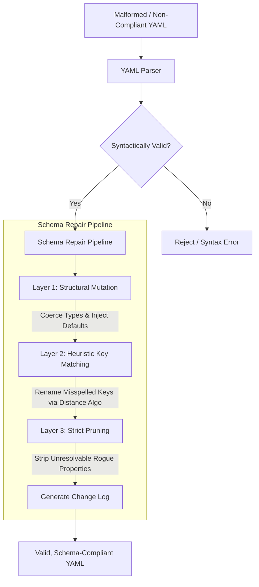

# Roadmap

- [ ] Handle Task Completion
- [x] Deno 2 Migration (from pnpm/nodejs)
- [x] Navigation Pane
  - [x] Implement Navigation Pane
  - [x] Show Child Nesting in Navigation Pane
- [ ] Improve Local Storage Model
  - [x] Implement verifiable auto-save on local storage
  - [ ] Test thoroughly on chromium-base, firefox, and safari
- [ ] Investigate cloud-backed up storage
- [ ] YAML Repair Tool
- [ ] Tech Debt Review
  - [x] Pass one - dead code cleanup (Rust exports, wasm bridge, types, CSS)
  - [ ] Pass two - App.tsx split (deferred)
  - [ ] Pass three - initiate a thorough re-review of tech debt
- [ ] Merge bottom and top menu bar to the top
- [x] Improve Default View
- [x] Remove NPM Dependency
- [x] Add Frontend Tests
- [x] Improve dev experience around linting
- [ ] Fact Check: Graph Algo
- [ ] Fact Check: node_modules decomm

## Handle Task Completion — Done vs Delete

**Status:** Punted (pending design decision)

Marking a task as "done" is semantically equivalent to deleting it from the
active graph, but carries different user intent. A deleted node re-maps its
children to its parent(s), which may not be the desired behavior for completed
tasks — users likely want to preserve completion state rather than collapse the
hierarchy.

**Key tension:** Delete removes a node and adopts its children into the
parent(s). Completion should probably preserve the node in some
archived/completed state, or at least distinguish itself visually and logically
from a hard delete.

**Next steps:** Decide whether "done" is a flag on the node (e.g.,
`completed: true`), a separate view/filter, or a distinct graph operation that
doesn't re-map children.

When a task is done, it has a "strikethrough" the text

## build a yaml repair tool - may be delusional or non-issue

if files get corrupted and therefore cannot be loaded into the graph, we should have a non-destructive method of auto-repair.

Agent suggested:

To implement a schema-repair engine, we will introduce a **three-tiered mutation pipeline** that intercepts YAML data immediately after parsing. First, the engine will run **automated type coercion and default injection** (e.g., casting stringified numbers and scaffolding missing required blocks) using native schema configuration options like AJV or Pydantic. Second, it will apply a **heuristic-matching layer** using Levenshtein distance algorithms to automatically detect and rename misspelled configuration keys. Finally, the system will execute a **strict structural prune** to strip unresolvable rogue properties, compiling all modifications into a transparent change-log returned to the user alongside the newly compliant, valid document.

## Technical Debt — Cleanup Pass (Principle Audit Findings)

The project lives well to its principles (lean dependencies, offline-first,
static deployable). This pass cleaned organizational debt, not architectural
bloat.

**Items:**

- **Split `App.tsx` (1109 lines)** — Handles 6+ concerns: state management, file
  I/O, menu logic, theme switching, help modals, and node CRUD. Extract custom
  hooks (file ops, workspace persistence) and narrow components. _(deferred)_

## fact check layout.ts vs Reingold and Tillman

https://williamyaoh.com/posts/2023-04-22-drawing-trees-functionally.html

## fat check: do we need node_modules?

No — `frontend/node_modules/` is required infrastructure for Deno 2's
`nodeModulesDir: "auto"` NPM compatibility mode. It's not leftover cruft from
pnpm/nodejs. See `README.md` > "Deno 2 NPM Compatibility (DO NOT REMOVE)".
